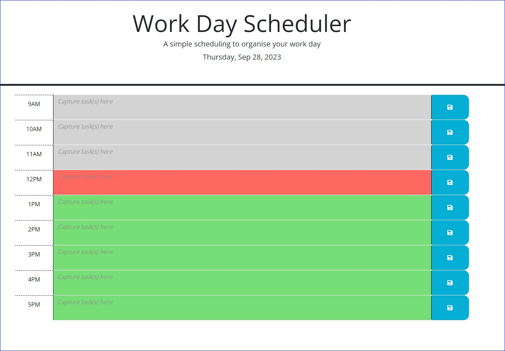

<a name="readme-top"></a>

# Work Day Scheduler

## Description

This webpage is a Work Day Scheduler allowing the user to capture tasks to complete for the day.

The Work Day Scheduler:
* Presents the current date
* Provides an hourly slot for tasks to be captured during work hours (9am to 5pm)
* Colours the background of each hourly slot based depending on whether it is in the past (grey), is current (red), or in the future (green)
* Allows the user to save tasks by clicking on the blue save button (Saving tasks will store them locally on that PC on that specific browser)

Note: this Work Day Scheuler has been enhanced from existing based code provided to me. 

## User Story

```
AS AN employee with a busy schedule
I WANT to add important events to a daily planner
SO THAT I can manage my time effectively

```
<p align="right">(<a href="#readme-top">back to top</a>)</p>

## User Acceptance Criteria

```
GIVEN I am using a daily planner to create a schedule

WHEN I open the planner
THEN the current day is displayed at the top of the calendar

WHEN I scroll down
THEN I am presented with timeblocks for standard business hours of 9am and 5pm

WHEN I view the timeblocks for that day
THEN each timeblock is color coded to indicate whether it is in the past, present, or future

WHEN I click into a timeblock
THEN I can enter an event

WHEN I click the save button for that timeblock
THEN the text for that event is saved in local storage

WHEN I refresh the page
THEN the saved events persist

```
<p align="right">(<a href="#readme-top">back to top</a>)</p>

## Screenshot

The below is a screenshot of the web application's appearance



<p align="right">(<a href="#readme-top">back to top</a>)</p>

## Installation

Cloning the repo is the only step required.

<p align="right">(<a href="#readme-top">back to top</a>)</p>


## Usage
<a name="URL"></a>
Link to deployed website is found here:
* https://hybee234.github.io/work-day-scheduler/

  
index.html, script.js and style.css files can be opened in Visual Studio Code

<p align="right">(<a href="#readme-top">back to top</a>)</p>
 

## Credits
Othneildrew - for the example on linking back to the top of the readme page!

<p align="right">(<a href="#readme-top">back to top</a>)</p>

## License

Please refer to the LICENSE in the repo.
<p align="right">(<a href="#readme-top">back to top</a>)</p>

## Badges

N/A
<p align="right">(<a href="#readme-top">back to top</a>)</p>

## Features

Extensive console logging has been embeeded across the application to capture important events:
* Functions being called
* Listener evenst being triggered

Extensive effort was invested into meaningful:
* Commentary in the script.js file

I hope this makes for easier review for anyone taking a closer look. Appreciate any feedback

<p align="right">(<a href="#readme-top">back to top</a>)</p>

## How to Contribute

N/A
<p align="right">(<a href="#readme-top">back to top</a>)</p>

## Tests

### Application specific:
* Validate that the correct date displays when the page loads
* Validate that you are presented with 9 slots where tasks can be captured (9am - 5pm) - each slot representing an hour of the working dya
* Validate that, compared to the current time, slots in the past are grey, the current hour is red and future hours are green
* Validate that you are able to type into the main field in each hourly slot (i.e. enter a task)
* Validate that when you save the task for the hour, that the task remains when you refresh the page


### Developer practice tests:
* Validate that the application deployed at the live URL (<a href="#URL">Navigate to URL</a>)
* Validate that the webpage loaded without errors
* Validate that GitHub URL has been submitted
* Validate that GitHub repository contains application code
* Validate that the application resembles mock-up provided in the challenge instructions
* Validate that the GitHub repository has a unique name
* Validate that the GitHub repostiory followed be practice for class/id naming conventions, indentation, quality comments, etc
* Validate that the repository contains multiple descriptive commit messages
* Validate that the repository contains a quality README file with description, screenshot and link to deployed applications

<p align="right">(<a href="#readme-top">back to top</a>)</p>

